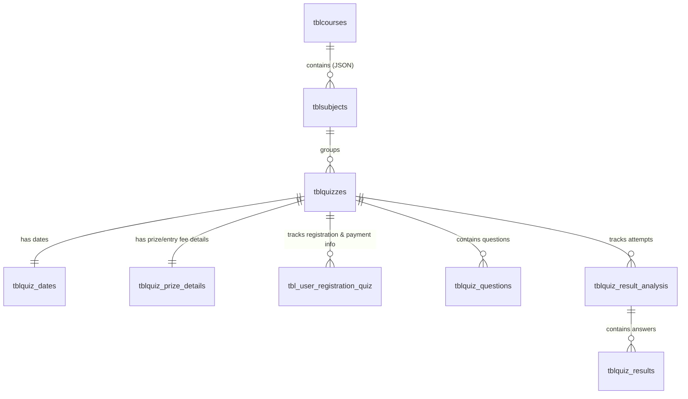

# Testerika Backend Complete Analysis & API Checklist

This document provides a comprehensive architectural and code-level analysis of the **Testerika Node.js Backend**. We analyze the current models, controllers, and routes to determine the changes required to support a premium, secure, and robust mobile client in **Flutter**.

---

## 1. Backend Microservices Overview
The backend is designed using a microservices pattern, where each service runs independently on its own port and interacts with the others via HTTP (axios) and a shared PostgreSQL database (`testerika_production`).

> [!NOTE]
> The Wallet microservice has been removed. All quiz entries are paid directly via the payment gateway on the client side, and transaction details are recorded directly inside the quiz registration table.

| Microservice | Default Port | Base API Path | Core Purpose |
|---|---|---|---|
| **User Service** | `6001` | `/api/user` | User profiles, authentication, user retrieval |
| **Question Service** | `6002` | `/api/question` | Question banks, options, hints, and correct solutions |
| **Quiz Service** | `6003` | `/api/quiz` | Quizzes, direct registrations (with transaction info), dates, and results |
| **Common Service** | `6008` | `/api/common` | Master records for Courses, Subjects, Slider, Option etc. |

---

## 2. Model & Database Schema Mappings
Sequelize associations are defined in `quiz/models/index.js` and `common/models/index.js`. Here is how the database tables are related:



### Table Definitions & Key Fields
1. **`tblcourses` (`common` service)**: Holds course configurations (e.g., JEE, NEET, Class 10).
   - Fields: `id`, `course_name`, `image`, `position`, `status`.
2. **`tblsubjects` (`common` service)**: Holds subjects linked to courses.
   - Fields: `id`, `subject_name`, `status`, `course_ids` (`Sequelize.JSON` stringified array of course IDs).
3. **`tblquizzes` (`quiz` service)**: Core quiz metadata.
   - Fields: `id`, `key`, `subject_id` (links to subject), `quiz_type_id`, `name`, `duration`, `total_questions`, `marks`, `language`, `status`.
4. **`tblquiz_dates` (`quiz` service)**: Timing configuration.
   - Fields: `id`, `quiz_id`, `reg_open_date`, `start_date`, `result_publish_date`.
5. **`tblquiz_prize_details` (`quiz` service)**: Financial details of the quiz.
   - Fields: `id`, `quiz_id`, `total_spots`, `entry_fee`, `prize_pool`, `first_prize`, `total_winner_percentage`, `prize_distribution_percentage`.
6. **`tbl_user_registration_quiz` (`quiz` service)**: Tracks which users registered for which quizzes and **holds payment transactions directly**.
   - Fields: `id`, `user_id`, `quiz_id`, `transaction_id` (STRING, nullable), `payment_status` (STRING, nullable), `amount_paid` (DECIMAL, nullable).

---

## 3. Core Backend Gaps & Security Risks
During our code review, we identified **seven critical gaps** that must be resolved before releasing the Flutter frontend.

### ⚠️ Gap 1: Quiz Prize Details are Commented Out in Database Queries
* **Location**: `quiz/controller/quiz.controller.js` -> `getQuizDetailsUserPanel` & `getLiveQuizDetailsUserPanel`
* **Impact**: When the mobile app fetches the list of available quizzes, the JSON response **completely excludes** `prize` details. Thus, the frontend cannot show the **entry fee**, **prize pool**, **spots**, or **first prize**.
* **Fix**: Uncomment the `QuizPrizeDetails` model inside all `include` blocks.

### ⚠️ Gap 2: Subject Route Lacks Course Filtering
* **Location**: `common/controller/subject.controller.js` -> `findAll` & `getAll`
* **Impact**: The frontend needs to show subjects *specific* to the selected Course. Currently, the backend returns all subjects regardless of the course because `course_ids` is stored as a JSON array and no filter is applied.
* **Fix**: Implement a `course_id` query parameter filtering on the backend via string/JSON matching.

### ⚠️ Gap 3: Free Registration Security Exploit & Direct Payments (Critical)
* **Location**: `quiz/controller/quiz.controller.js` -> `userRegistration`
* **Impact**: The endpoint `POST /api/quiz/userRegistration` directly creates a registration in `tbl_user_registration_quiz` without validating if the quiz is paid or checking if the user actually paid. Users could bypass payments and register for paid quizzes for free!
* **Fix**: Modify `tbl_user_registration_quiz` to store the payment transaction. The backend must first check the quiz fee. If `entry_fee > 0`, it must verify that `transaction_id` and a successful `payment_status` (e.g. `"SUCCESS"`) are provided in the payload before inserting the registration.

### ⚠️ Gap 4: Missing Endpoint to List Registered Quizzes for a User
* **Location**: `quiz/controller/quiz.controller.js` & `quiz/routes/quiz.routes.js`
* **Impact**: Requirement 3 requires listing all quizzes a user has registered for. Currently, there is **no endpoint** to list quizzes by `user_id` from `tbl_user_registration_quiz`.
* **Fix**: Create a new API route `GET /api/quiz/getUserRegisteredQuizzes/:user_id`.

### ⚠️ Gap 5: Starting Quiz without Registration
* **Location**: `quiz/controller/quiz.controller.js` -> `initializedQuizStatus`
* **Impact**: The endpoint used to start a quiz allows any user to start it without verifying if they are registered in `tbl_user_registration_quiz`.
* **Fix**: Add a validation step checking if `UserRegistration` exists for `user_id` and `quiz_id`.

### ⚠️ Gap 6: Quiz Results Exclude Prize Money Calculation
* **Location**: `quiz/controller/quiz.controller.js` -> `getQuizResultUsingUserIdAndQuizKey`
* **Impact**: Requirement 4 states that the results screen must show the prize the user gets. The current results endpoint calculates the rank and marks but **does not calculate or return** the prize money won.
* **Fix**: Fetch `tblquiz_prize_details` and dynamically calculate `prize_won` based on rank and distribution percentage, then return it in the response payload.

### ⚠️ Gap 7: Attempted/Resumed Quizzes List Excludes Dates & Prizes
* **Location**: `quiz/controller/quiz.controller.js` -> `getUserAttemptedQuizzes`
* **Impact**: This endpoint (used for Requirements 5 and 6) fetches quiz details but excludes dates (`QuizDates`) and prizes (`QuizPrizeDetails`), leaving the resumed/completed dashboards with incomplete details.
* **Fix**: Add `QuizDates` and `QuizPrizeDetails` into the relation `include` block inside `getUserAttemptedQuizzes`.

---

## 4. Complete API Directory for Flutter

Here is the precise mapping of API endpoints required by the Flutter frontend, along with microservice ports, request payloads, and response JSON schemas.

### API 1: Fetch All Courses
* **Service**: Common Service (Port `6008` / `/api/common`)
* **Endpoint**: `GET /api/common/course/getAll`
* **Response Payload (JSON)**:
```json
[
  {
    "id": 1,
    "category_id": 2,
    "course_name": "IIT-JEE Crash Course",
    "image": "https://api.testerika.com/uploads/jee.png",
    "position": 1,
    "status": 1
  }
]
```

### API 2: Fetch Subjects for a Selected Course
* **Service**: Common Service (Port `6008` / `/api/common`)
* **Endpoint**: `GET /api/common/subject/getAll?course_id=1`
* **Query Parameters**:
  - `course_id` (int, required) - Filter subjects belonging to this course.
* **Response Payload (JSON)**:
```json
[
  {
    "id": 1,
    "subject_name": "Physics",
    "course_ids": "[1,2,3]",
    "status": 1
  }
]
```

### API 3: Fetch Available Quizzes for a Subject
* **Service**: Quiz Service (Port `6003` / `/api/quiz`)
* **Endpoint**: `GET /api/quiz/quiz/quizzes/status/get`
* **Query Parameters**:
  - `category` (int, required) - Pass the **Subject ID** here. It maps directly to `subject_id` in `tblquizzes`.
  - `type` (string, required) - Case-sensitive filter. Pass **`"Quizzes"`** to fetch normal quizzes (Free/Premium) or **`"Live"`** to fetch live scheduled quizzes.
  - `page` (int, optional, default `1`) - Pagination page index.
  - `items_per_page` (int, optional, default `10`) - Number of quizzes per page.

> [!IMPORTANT]
> **Why this API might return an empty list `[]` even if data exists in the database:**
> 1. **`status` Column must be 1**: The database record in `tblquizzes` must have `status = 1`. Inactive quizzes (`status = 0` or `null`) are excluded from the user panel.
> 2. **Master Types in `tblquiz_types`**: The backend resolves types by name. You must have rows in your `tblquiz_types` database table with the exact strings:
>    * `"Free Quiz"` and `"Premium Quiz"` (for `type=Quizzes`)
>    * `"Live Quiz"` (for `type=Live`)
>    If the master table is empty or names differ, the search resolves to empty lists.
> 3. **Subject ID Match**: Ensure that the quiz record has the column `subject_id` set to the exact integer passed in `category` (e.g. `subject_id = 1` for `category=1`).

* **Response Payload (JSON)**:
```json
{
  "data": [
    {
      "id": 10,
      "key": "quiz_ref_101",
      "name": "Electromagnetism Mega Challenge",
      "duration": 45,
      "total_questions": 30,
      "marks": "120.00",
      "language": "English",
      "dates": {
        "id": 2,
        "quiz_id": 10,
        "reg_open_date": "2026-05-20T00:00:00.000Z",
        "start_date": "2026-05-21T18:00:00.000Z",
        "result_publish_date": "2026-05-21T20:00:00.000Z"
      },
      "prize": {
        "id": 5,
        "quiz_id": 10,
        "total_spots": 100,
        "entry_fee": "50.00",
        "prize_pool": "4000.00",
        "first_prize": "1000.00",
        "total_winner_percentage": 50,
        "prize_distribution_percentage": "10.00"
      }
    }
  ],
  "payload": {
    "pagination": { "total": 1, "page": 1, "items_per_page": 10 }
  }
}
```

### API 4: Register User for a Quiz (Direct Payment Input)
* **Service**: Quiz Service (Port `6003` / `/api/quiz`)
* **Endpoint**: `POST /api/quiz/quiz/userRegistration`
* **Headers**: `Authorization: Bearer <token>`
* **Request Body - Free Quiz (JSON)**:
```json
{
  "id": 10, 
  "user_id": 15
}
```
* **Request Body - Paid Quiz (JSON)**:
```json
{
  "id": 10, 
  "user_id": 15,
  "transaction_id": "pay_RZP123456789",
  "payment_status": "SUCCESS",
  "amount_paid": 50.00
}
```
* **Response Payload (JSON)**:
```json
{
  "success": true,
  "message": "Registration Successful",
  "data": {
    "id": 482,
    "user_id": 15,
    "quiz_id": 10,
    "transaction_id": "pay_RZP123456789",
    "payment_status": "SUCCESS",
    "amount_paid": "50.00",
    "createdAt": "2026-05-20T10:30:00.000Z"
  }
}
```

### API 5: Fetch Registered Quizzes for User
* **Service**: Quiz Service (Port `6003` / `/api/quiz`)
* **Endpoint**: `GET /api/quiz/quiz/getUserRegisteredQuizzes/15`
* **Headers**: `Authorization: Bearer <token>`
* **Response Payload (JSON)**:
```json
{
  "success": true,
  "data": [
    {
      "id": 1,
      "user_id": 15,
      "quiz_id": 10,
      "transaction_id": "pay_RZP123456789",
      "payment_status": "SUCCESS",
      "amount_paid": "50.00",
      "quiz": {
        "id": 10,
        "key": "quiz_ref_101",
        "name": "Electromagnetism Mega Challenge",
        "duration": 45,
        "total_questions": 30,
        "marks": "120.00",
        "dates": {
          "start_date": "2026-05-21T18:00:00.000Z"
        },
        "prize": {
          "entry_fee": "50.00",
          "prize_pool": "4000.00"
        }
      }
    }
  ]
}
```

### API 6: Initialize / Start Quiz Play
* **Service**: Quiz Service (Port `6003` / `/api/quiz`)
* **Endpoint**: `POST /api/quiz/quiz/intializedQuizAnalysisStatus/status`
* **Headers**: `Authorization: Bearer <token>`
* **Request Body (JSON)**:
```json
{
  "user_id": 15,
  "quiz_id": 10
}
```
* **Response Payload (JSON)**:
```json
{
  "success": true,
  "message": "Quiz Started Successfully"
}
```

### API 7: Fetch Quiz Questions
* **Service**: Quiz Service (Port `6003` / `/api/quiz`)
* **Endpoint**: `GET /api/quiz/quiz/getQuizDetailForgettingQuestion/:key/:user_id`
* **Headers**: `Authorization: Bearer <token>`
* **Response Payload (JSON)**:
```json
{
  "success": true,
  "quiz": {
    "id": 10,
    "key": "quiz_ref_101",
    "name": "Electromagnetism Mega Challenge",
    "duration": 45,
    "questions": [
      {
        "id": 1,
        "quiz_id": 10,
        "question_bank_id": 501
      }
    ]
  },
  "time_taken": 0
}
```

### API 8: Submit Answer (Real-time option selection)
* **Service**: Quiz Service (Port `6003` / `/api/quiz`)
* **Endpoint**: `POST /api/quiz/quiz/submitQuizQuestionAnswer`
* **Headers**: `Authorization: Bearer <token>`
* **Request Body (JSON)**:
```json
{
  "user_id": 15,
  "quiz_id": 10,
  "question_id": 204,
  "option_id": 816,
  "total_questions": 30,
  "time_taken": 120
}
```
* **Response Payload (JSON)**:
```json
{
  "success": true,
  "message": "Answer Saved Successfully"
}
```

### API 9: Submit Completed Quiz
* **Service**: Quiz Service (Port `6003` / `/api/quiz`)
* **Endpoint**: `POST /api/quiz/quiz/submitQuizResult/result/submit`
* **Request Body (JSON)**:
```json
{
  "user_id": 15,
  "quiz_id": 10
}
```
* **Response Payload (JSON)**:
```json
{
  "success": true,
  "message": "Quiz Submitted Successfully"
}
```

### API 10: Get Score, Rank, and Prize Won
* **Service**: Quiz Service (Port `6003` / `/api/quiz`)
* **Endpoint**: `POST /api/quiz/quiz/getQuizResult/result/get`
* **Request Body (JSON)**:
```json
{
  "user_id": 15,
  "quiz_key": "quiz_ref_101"
}
```
* **Response Payload (JSON)**:
```json
{
  "success": true,
  "message": "Result Declared Successfully",
  "total_user": 45,
  "data": {
    "user_id": 15,
    "total_correct": 28,
    "total_incorrect": 2,
    "total_points": 110,
    "total_time_taken": 2200,
    "result_analysis_id": 98,
    "rank": 2,
    "prize_won": "500.00" 
  }
}
```

### API 11: List Resumed and Attempted Quizzes
* **Service**: Quiz Service (Port `6003` / `/api/quiz`)
* **Endpoint**: `GET /api/quiz/quiz/getUserAttemptedQuizzes/15?status=progress` (For Resumed) or `status=completed` (For Attempted)
* **Headers**: `Authorization: Bearer <token>`
* **Response Payload (JSON)**:
```json
{
  "success": true,
  "data": [
    {
      "id": 98,
      "user_id": 15,
      "quiz_id": 10,
      "quiz_status": "initialized",
      "time_taken": 450,
      "quiz": {
        "id": 10,
        "name": "Electromagnetism Mega Challenge",
        "marks": "120.00",
        "duration": 45,
        "total_questions": 30,
        "language": "English",
        "key": "quiz_ref_101",
        "dates": {
          "start_date": "2026-05-21T18:00:00.000Z"
        },
        "prize": {
          "entry_fee": "50.00",
          "prize_pool": "4000.00"
        }
      }
    }
  ]
}
```

---

## 5. Required Backend Code Snippets (Ready to Apply)

### Fix 1: Database Migration - Store Payment Details Directly in User Registration Table
Since we are bypassing the wallet service, we must update the `tbl_user_registration_quiz` model so it can record transaction details.

Update `/Users/datacubesoftech/StudioProjects/testerika-backend/quiz/models/user_registration_quiz.js`:
```javascript
module.exports = (sequelize, Sequelize) => {
  const UserRegistration = sequelize.define(
    'tbl_user_registration_quiz',
    {
      id: {
        allowNull: false,
        autoIncrement: true,
        primaryKey: true,
        type: Sequelize.INTEGER,
      },
      user_id: {
        type: Sequelize.INTEGER,
      },
      quiz_id: {
        type: Sequelize.INTEGER,
      },
      transaction_id: {
        type: Sequelize.STRING,
        allowNull: true,
      },
      payment_status: {
        type: Sequelize.STRING, // e.g., 'SUCCESS', 'PENDING'
        allowNull: true,
      },
      amount_paid: {
        type: Sequelize.DECIMAL,
        allowNull: true,
      },
      createdAt: {
        type: Sequelize.DATE,
        allowNull: false
      },
      updatedAt: {
        type: Sequelize.DATE,
        allowNull: false
      },
      deletedAt: {
        type: Sequelize.DATE,
        allowNull: true
      }
    },
    {
      tableName: "tbl_user_registration_quiz"
    }
  );
  return UserRegistration;
};
```

### Fix 2: Uncomment `QuizPrizeDetails` in `quiz.controller.js`
Search for `getQuizDetailsUserPanel` (around line 1526) and `getLiveQuizDetailsUserPanel` (around line 1740) in `quiz/controller/quiz.controller.js` and edit the includes from:
```javascript
// {
//   model: QuizPrizeDetails,
//   required: false,
//   as: 'prize',
// },
```
to:
```javascript
{
  model: QuizPrizeDetails,
  required: false,
  as: 'prize',
},
```

### Fix 3: Direct Payment & Registration Verification in `userRegistration`
Ensure that paid quizzes enforce a valid payment payload inside the registration call itself.
```javascript
// In quiz.controller.js -> userRegistration
exports.userRegistration = async (req, res) => {
  try {
    const { id, user_id, transaction_id, payment_status, amount_paid } = req.body;
    
    // Check if quiz is paid
    const prizeDetail = await QuizPrizeDetails.findOne({ where: { quiz_id: id } });
    
    if (prizeDetail && Number(prizeDetail.entry_fee) > 0) {
      // Direct payment validation: Paid quizzes MUST provide transaction details
      if (!transaction_id || payment_status !== "SUCCESS" || !amount_paid) {
        return res.status(200).json({
          success: false,
          message: "Payment transaction missing or incomplete for this paid quiz!"
        });
      }
      
      // Optionally compare amount paid with the actual entry fee
      if (Number(amount_paid) < Number(prizeDetail.entry_fee)) {
        return res.status(200).json({
          success: false,
          message: "Incorrect payment amount received!"
        });
      }
    }
    
    // Proceed directly with registration (storing payment values)
    const data = await UserRegistration.create({ 
      quiz_id: id, 
      user_id,
      transaction_id: transaction_id || null,
      payment_status: payment_status || null,
      amount_paid: amount_paid || null
    });
    
    return res.status(200).json({
      success: true,
      message: "Registration Successful",
      data
    });
  } catch (err) {
    return res.status(500).json({ success: false, message: err.message });
  }
};
```

### Fix 4: Create a New Route: "Get Registered Quizzes for a User"
Add this implementation into `quiz/controller/quiz.controller.js`:
```javascript
// In quiz.controller.js
exports.getUserRegisteredQuizzes = async (req, res) => {
  try {
    const { user_id } = req.params;
    const registrations = await UserRegistration.findAll({
      where: { user_id },
      include: [
        {
          model: Quizzes,
          include: [
            { model: QuizDates, as: "dates", required: false },
            { model: QuizPrizeDetails, as: "prize", required: false }
          ]
        }
      ]
    });
    
    return res.status(200).json({
      success: true,
      data: registrations
    });
  } catch (err) {
    console.error("getUserRegisteredQuizzes Error: ", err);
    return res.status(500).json({ success: false, message: err.message });
  }
};
```
Mount it in `quiz/routes/quiz.routes.js`:
```javascript
router.get("/getUserRegisteredQuizzes/:user_id", checkUserAuthorizedOrNot, quizController.getUserRegisteredQuizzes);
```

### Fix 5: Verify Registration before Starting Quiz Play
Add registration checks directly in `initializedQuizStatus` (around line 2207) to ensure only registered users can play.
```javascript
// In quiz.controller.js -> initializedQuizStatus
exports.initializedQuizStatus = async (req, res) => {
  try {
    const { user_id, quiz_id } = req.body;
    
    // Verify that the user has registered for this quiz in the registration table
    const registration = await UserRegistration.findOne({
      where: { user_id, quiz_id }
    });
    
    if (!registration) {
      return res.status(200).json({
        success: false,
        message: "You must register for this quiz before starting!"
      });
    }

    const findQuiz = await QuizResultAnalysis.findOne({
      where: {
        user_id, quiz_id, quiz_status: {
          [Op.or]: ["initialized", "running"]
        }
      }
    });

    if (findQuiz) {
      return res.status(200).json({
        success: true,
        message: "Quiz Started Successfully"
      });
    } else {
      const findQuizDetail = await QuizQuestions.count({
        where: { quiz_id }
      });
      
      if (!findQuizDetail) {
        return res.status(200).json({
          success: false,
          message: "Quiz is inactive now. Please contact support."
        });
      } else {
        const createResultAnalysis = await QuizResultAnalysis.create({ 
          user_id, 
          quiz_id, 
          quiz_status: "initialized" 
        });
        
        if (createResultAnalysis) {
          return res.status(200).json({
            success: true,
            message: "Quiz Started Successfully"
          });
        } else {
          return res.status(200).json({
            success: false,
            message: "Please try again."
          });
        }
      }
    }
  } catch (err) {
    return res.status(500).json({
      success: false,
      message: err.message
    });
  }
};
```

### Fix 6: Calculate Prize Won in `getQuizResultUsingUserIdAndQuizKey`
Add prize pool calculation into `quiz.controller.js` -> `getQuizResultUsingUserIdAndQuizKey` after sorting ranks:
```javascript
// In quiz.controller.js around line 2146
const prizeDetail = await QuizPrizeDetails.findOne({ where: { quiz_id: findQuiz.id } });
let prizeWon = "0.00";

if (prizeDetail && filterData) {
  const rank = filterData.rank;
  const totalSpots = prizeDetail.total_spots;
  const winningRanksLimit = Math.floor(totalSpots * (prizeDetail.total_winner_percentage / 100));

  if (rank === 1) {
    prizeWon = prizeDetail.first_prize;
  } else if (rank <= winningRanksLimit) {
    // Dynamic prize calculation based on remaining prize pool shared equally among winners
    const remainingPrizePool = Number(prizeDetail.prize_pool) - Number(prizeDetail.first_prize);
    const remainingWinners = winningRanksLimit - 1;
    if (remainingWinners > 0) {
      prizeWon = (remainingPrizePool / remainingWinners).toFixed(2);
    }
  }
}

return res.status(200).json({
  success: true,
  message: "Result Declared Successfully",
  total_user: newData.length,
  data: {
    ...filterData,
    prize_won: prizeWon
  },
  allAttempt: findAllAttempt
});
```

### Fix 7: Include Dates & Prizes in `getUserAttemptedQuizzes`
Update the include definition inside `getUserAttemptedQuizzes` to ensure full data is retrieved:
```javascript
// In quiz.controller.js -> getUserAttemptedQuizzes
const attempts = await QuizResultAnalysis.findAll({
  where: {
    user_id: user_id,
    quiz_status: statusFilter
  },
  include: [
    {
      model: Quizzes,
      attributes: ["id", "name", "marks", "duration", "total_questions", "language", "key"],
      include: [
        { model: QuizDates, as: "dates", required: false },
        { model: QuizPrizeDetails, as: "prize", required: false }
      ]
    }
  ],
  order: [["id", "DESC"]]
});
```
